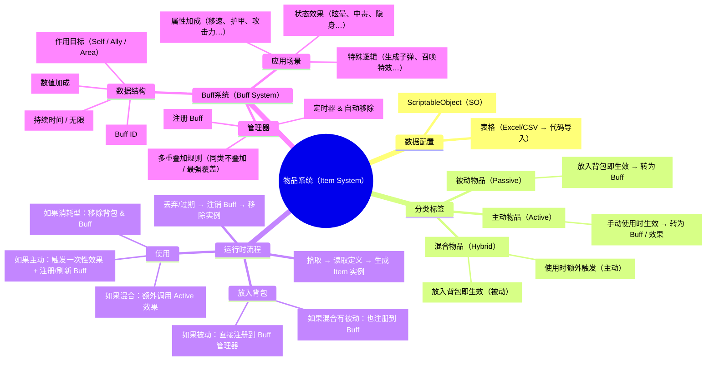
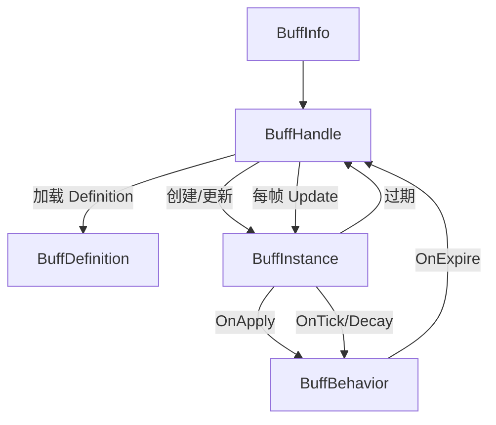
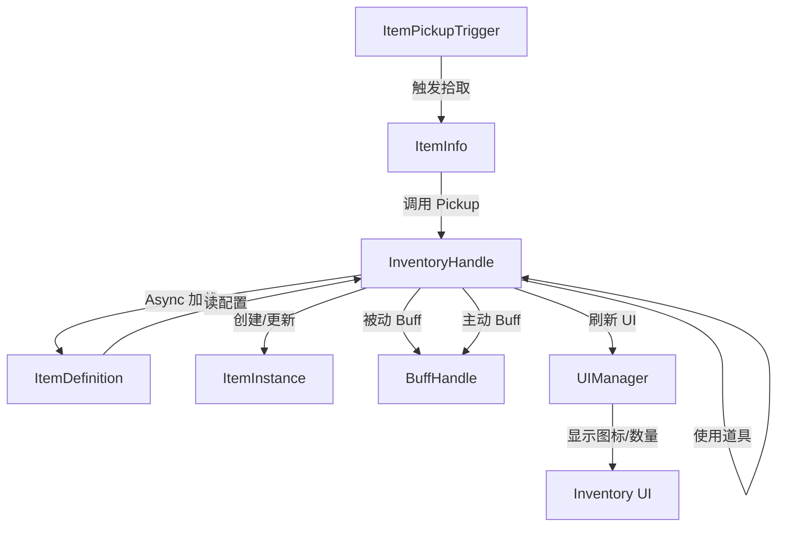
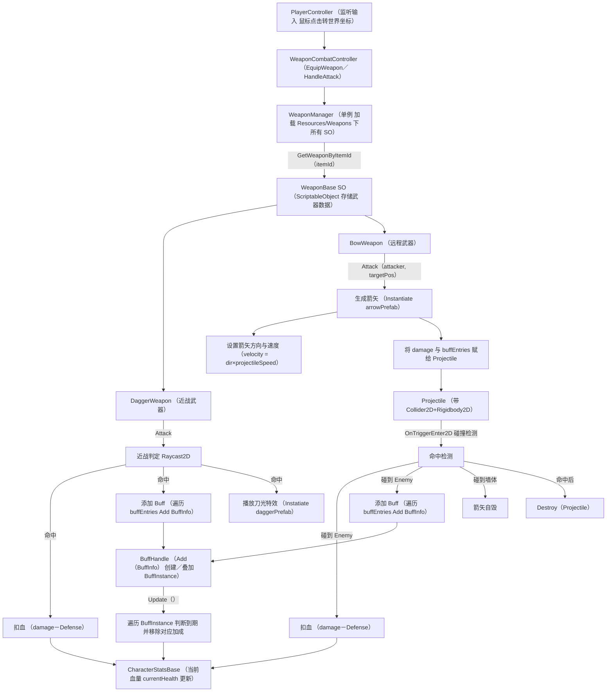

## 物品系统思维图

```mermaid
mindmap
  root((物品系统（Item System）))
    数据配置
      SO[ScriptableObject（SO）]
      表格[表格（Excel/CSV → 代码导入）]
    分类标签
      被动[被动物品（Passive）]
        生效[放入背包即生效 → 转为 Buff]
      主动[主动物品（Active）]
        生效[手动使用时生效 → 转为 Buff / 效果]
      混合[混合物品（Hybrid）]
        被动生效[放入背包即生效（被动）]
        额外触发[使用时额外触发（主动）]
    运行时流程
      拾取[拾取 → 读取定义 → 生成 Item 实例]
      放入背包
        被动[如果被动：直接注册到 Buff 管理器]
        混合[如果混合有被动：也注册到 Buff]
      使用
        主动[如果主动：触发一次性效果 + 注册/刷新 Buff]
        消耗[如果消耗型：移除背包 & Buff]
        混合[如果混合：额外调用 Active 效果]
      丢弃[丢弃/过期 → 注销 Buff → 移除实例]
    Buff系统（Buff System）
      数据结构
        ID[Buff ID]
        时间[持续时间 / 无限]
        数值[数值加成]
        目标[作用目标（Self / Ally / Area）]
      管理器
        注册[注册 Buff]
        定时器[定时器 & 自动移除]
        叠加[多重叠加规则（同类不叠加 / 最强覆盖）]
      应用场景
        属性[属性加成（移速、护甲、攻击力…）]
        状态[状态效果（眩晕、中毒、隐身…）]
        特殊[特殊逻辑（生成子弹、召唤特效…）]
```

## buff系统思维图

```mermaid
flowchart TD
  A[BuffInfo] --> B[BuffHandle]
  B -->|加载 Definition| C[BuffDefinition]
  B -->|创建/更新| D[BuffInstance]
  D -->|OnApply| E[BuffBehavior]
  B -->|每帧 Update| D
  D -->|OnTick/Decay| E
  D -->|过期| B
  E -->|OnExpire| B
```
    
## 物品效果思维图

``` mermaid
 flowchart TD
  P[ItemPickupTrigger] -->|触发拾取| I[ItemInfo]
  I -->|调用 Pickup| H[InventoryHandle]
  H -->|Async 加载| D[ItemDefinition]
  D -->|读配置| H
  H -->|创建/更新| N[ItemInstance]
  H -->|被动 Buff| BH[BuffHandle]
  H -->|刷新 UI| U[UIManager]
  U -->|显示图标/数量| UI[Inventory UI]
  H -->|使用道具| H
  H -->|主动 Buff| BH
``` 

## 战斗系统

``` mermaid
flowchart TD
  %% 玩家输入与控制
  PC[PlayerController （监听输入 鼠标点击转世界坐标）] --> WCC[WeaponCombatController （EquipWeapon／HandleAttack）]

  %% 武器管理
  WCC --> WM[WeaponManager （单例 加载 Resources/Weapons 下所有 SO）]
  WM -->|GetWeaponByItemId（itemId）| WS[WeaponBase SO （ScriptableObject 存储武器数据）]

  %% 具体武器逻辑分支
  WS --> DW[DaggerWeapon （近战武器）]
  WS --> BW[BowWeapon （远程武器）]

  %% 匕首攻击流程
  DW -->|Attack | DR[近战判定 Raycast2D]
  DR -->|命中| DD[扣血 （damage－Defense）]
  DR -->|命中| DB[添加 Buff （遍历 buffEntries Add BuffInfo）]
  DR -->|命中| DE[播放刀光特效 （Instatiate daggerPrefab）]

  %% 弓箭攻击流程
  BW -->|Attack（attacker, targetPos）| BP[生成箭矢 （Instantiate arrowPrefab）]
  BP --> BR[设置箭矢方向与速度 （velocity = dir×projectileSpeed）]
  BP --> BP2[将 damage 与 buffEntries 赋给 Projectile]
  
  %% 箭矢飞行与命中
  BP2 --> PR[Projectile （带 Collider2D+Rigidbody2D）]
  PR -->|OnTriggerEnter2D 碰撞检测| PRD[命中检测]
  PRD -->|碰到 Enemy| PD[扣血 （damage－Defense）]
  PRD -->|碰到 Enemy| PB[添加 Buff （遍历 buffEntries Add BuffInfo）]
  PRD -->|碰到墙体| PW[箭矢自毁]
  PRD -->|命中后| PD2[Destroy（Projectile）]

  %% 属性与 Buff 管理
  DD --> CS[CharacterStatsBase （当前血量 currentHealth 更新）]
  PD --> CS
  DB --> BH[BuffHandle （Add（BuffInfo） 创建／叠加 BuffInstance）]
  PB --> BH
  BH -->|Update（）| BHU[遍历 BuffInstance 判断到期 并移除对应加成]
  BHU --> CS


``` 