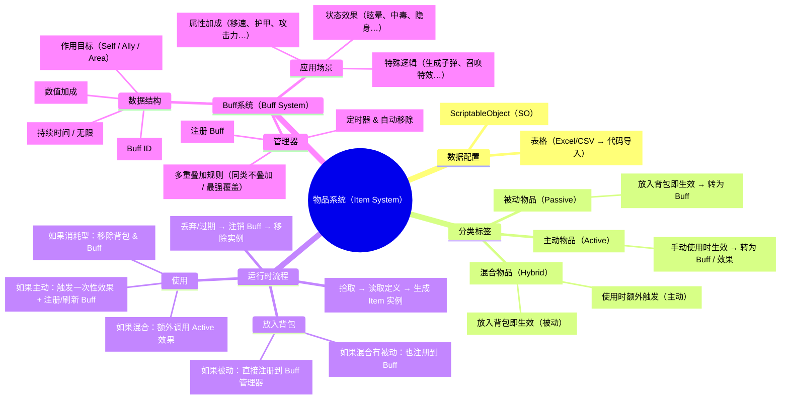

## 物品系统思维图




## buff系统思维图

```mermaid
flowchart TD
  A[BuffInfo] --> B[BuffHandle]
  B -->|加载 Definition| C[BuffDefinition]
  B -->|创建/更新| D[BuffInstance]
  D -->|OnApply| E[BuffBehavior]
  B -->|每帧 Update| D
  D -->|OnTick/Decay| E
  D -->|过期| B
  E -->|OnExpire| B
 ```

 ## 物品效果思维图
 ``` mermaid
 flowchart TD
  P[ItemPickupTrigger] -->|触发拾取| I[ItemInfo]
  I -->|调用 Pickup| H[InventoryHandle]
  H -->|Async 加载| D[ItemDefinition]
  D -->|读配置| H
  H -->|创建/更新| N[ItemInstance]
  H -->|被动 Buff| BH[BuffHandle]
  H -->|刷新 UI| U[UIManager]
  U -->|显示图标/数量| UI[Inventory UI]
  H -->|使用道具| H
  H -->|主动 Buff| BH
```